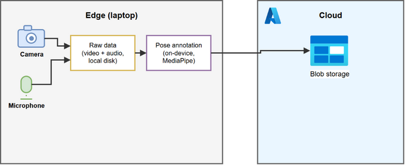

# shot-improvement

Native Python (no browser) app for reviewing padel/hockey practice
shots: records clips from this laptop's own webcam and microphone,
detects each shot from the audio (the stick-to-puck/ball impact),
measures its speed, and annotates the clip - all on-device, nothing
sent anywhere until the finished clip is uploaded.

## What it does today

- **Record**: a live annotated camera preview, a record button, a
  recordings list with play/delete (GUI); or a one-shot CLI. Both save
  a raw clip and a pose-annotated clip into `recordings/` (gitignored).
- **Detect each shot from the audio**: finds the loud stick/puck
  impact sounds, pairs a shot with the moment it hits the far end, and
  computes the puck's speed from a rink's real 61m length (spec 098).
- **Annotate**: on-device MediaPipe `PoseLandmarker` draws a yellow
  box on each visible hand (spec 100/102/103); the annotated clip also
  gets a spectrogram + a claps/speed band under the video, and a plain
  snapshot JPEG per detected shot with the speed burned in (spec 099).
- **Sync to the cloud**: every clip (raw + annotated + a preview image)
  uploads in the background to two independent backends - GCS and
  Azure Blob Storage (spec 095) - each backing its own web gallery (see
  "Two galleries" below).

See "## Architecture" below for the edge/cloud shape of this, and
`specs/` for the full build history (every increment, in order, with
the reasoning behind it):
[080](specs/080-shot-improvement-native-python.md) (CLI),
[081](specs/081-shot-improvement-native-gui.md) (GUI),
[082](specs/082-shot-improvement-gui-controls-and-playback.md)
(camera/mic/speaker dropdowns, duration control, native in-window
playback, an annotation bug fix),
[083](specs/083-shot-improvement-logging-and-freeze-fix.md) (logging, a
real freeze fix, a measured throughput win),
[084](specs/084-shot-improvement-playback-controls.md) (full playback
transport controls),
[085](specs/085-shot-improvement-spectrogram-and-background-removal.md)
(spectrogram panel, background removal),
[086](specs/086-shot-improvement-performance.md) (deferred pose
inference, a measured fps win), and
[087](specs/087-shot-improvement-web-gallery.md) (cloud sync to a web
gallery),
[092](specs/092-shot-improvement-performance-profiling.md) (opt-in
time/memory/disk profiling, `tools/bench_record.py` /
`tools/bench_live.py`, and a fused annotate+spectrogram pass), and
[093](specs/093-shot-improvement-deferred-processing.md) ("Vain
nauhoitus" recording-only mode - capture now, process the backlog
later on request), and
[094](specs/094-shot-improvement-raw-sync-and-previews.md) (raw clips
now sync to the cloud too, plus a preview image per video), and
[095](specs/095-shot-improvement-azure-gallery.md) (a second,
Azure-hosted gallery at
[shot.timolehtonen.tech](https://shot.timolehtonen.tech) - `server/`
in this repo, backed by Azure Blob Storage), and
[096](specs/096-shot-improvement-microsoft-entra-auth.md) (that
gallery's sign-in swapped to Microsoft Entra ID - no GCP dependency
anywhere in that service), and
[097](specs/097-shot-improvement-av-sync-fix.md) (fixed an
audio/video sync bug - video frames were timestamped assuming even
capture spacing, which this hardware's camera doesn't actually
provide), and
[098](specs/098-shot-improvement-clap-detection.md) (a first real
version of the padel/hockey motion-tracking feature this app exists
for: detects loud shot/hit sounds in the audio, pairs them
chronologically, and annotates each pair's puck speed - a third band
under the video/spectrogram, computed from a rink's real 61m length),
and
[099](specs/099-shot-improvement-shot-images.md) (a plain snapshot
JPEG per detected shot - the exact frame the stick hits the puck,
native 1280x720, with the computed speed burned in), and
[100](specs/100-shot-improvement-puck-and-stick-detection.md) (puck
and hockey-stick detection - tested via `tools/annotate_image.py`
against a real still photo; hand boxes are now half-size and labeled
in English), and
[101](specs/101-shot-improvement-stick-between-hands.md) (redesigned
on feedback: puck annotation removed; the stick's yellow shaft is
anchored between the player's two hands - using MediaPipe's own
position estimate even for a hand too occluded to draw its own box -
and its red blade is a traced extension past the lower hand, not a
puck-anchored box), and
[102](specs/102-shot-improvement-shot-image-hand-boxes.md) (dropped
stick/blade detection entirely on further feedback - hand boxes are
now yellow-only, and the per-shot snapshot JPEGs from spec 099 get
those same hand-box annotations too, not just the speed label), and
[103](specs/103-shot-improvement-hand-box-no-labels.md) (hand boxes
are rectangle-only now - no "left hand"/"right hand" text), and
[104](specs/104-shot-improvement-vfr-and-shots-only.md) (fixed a
frame-count desync on variable-frame-rate sources like phone screen
recordings, and added a `--shots-only` mode to
`tools/annotate_existing_video.py` for this laptop's ~4GB RAM, which
the full per-frame pass can exceed on a real clip), and
[105](specs/105-shot-improvement-keep-temp-dir.md) (temporarily keeps
each GUI recording's temp dir - raw/annotated frames + audio.wav -
on disk instead of deleting it right after processing, path shown in
the GUI, for manual inspection), and
[106](specs/106-shot-improvement-shot-browser.md) (the GUI shows the
detected shots - camera frame, hand boxes, spectrogram strip, km/h -
right after a recording finishes, browsable in a list below the
preview, well before the slower background video encode completes;
"Vain nauhoitus" mode gets the same shot list without producing an
mp4 at all), and
[107](specs/107-shot-improvement-raw-shot-playback.md) (a "Play"
button next to each shot's speed plays the raw, unannotated footage
from 2s before the shot through to its paired hit, built on demand
and cached per shot; finishing it returns to the shot list), and
[108](specs/108-shot-improvement-raw-shot-frame-playback.md)
(replaced spec 107's ffmpeg-encoded clip with direct playback of the
shot's own raw BMP frames - no encoding, no audio, no temp file - with
a 0.25x/0.5x/1.0x/2.0x speed picker), and
[109](specs/109-shot-improvement-force-manual-exposure.md) (forces a
short, fixed camera exposure - auto-exposure was found lengthening
per-frame exposure time under normal room lighting, capping real
captured fps around 10-14 instead of the negotiated 60; a
darker/blurrier picture is an accepted tradeoff for keeping fps up),
[110](specs/110-shot-improvement-keep-processed-pending-files.md)
(a processed "Vain nauhoitus" item's raw frames/audio are now archived
to pending/processed/, not deleted, on explicit standing request), and
[111](specs/111-shot-improvement-spectral-shot-detection.md) (shot
detection now uses non-maximum suppression plus a spectral gate - a
real event's FFT energy in 2-8kHz, not just its loudness - instead of
spec 098's "cluster a contiguous loud span into one event", and
pairing now matches a shot to a hit only within a physically plausible
puck-travel window instead of blindly pairing every two consecutive
claps; both fixes were found and validated against real Audacity-
marked ground truth), and
[112](specs/112-shot-improvement-manual-focus-fps-ceiling.md) (fixes
autofocus too, alongside spec 109's manual exposure - a real
improvement, but real capture throughput still lands at a clean, exact
30.0fps regardless of resolution or any other camera property tried;
documented as a likely genuine ceiling of this camera's MJPG mode over
DirectShow on this system, not something further property tuning
fixes),
[113](specs/113-shot-improvement-30fps-is-the-real-ceiling.md)
(confirms it: a user-supplied OBS reference file that reports 60fps
turns out to have 50.6% duplicate consecutive frames - the real
ceiling on this hardware is ~30 unique frames/sec regardless of what
any tool's output file declares; decided to accept it rather than pad
with duplicate frames that would carry no real motion data),
[114](specs/114-shot-improvement-defer-processing-by-default.md)
("Vain nauhoitus" now defaults to checked - a real burst test measured
a recording overlapping a previous one's background processing
capturing 0 of ~330 expected frames on this 3.83GB machine, not just
running slower), and
[115](specs/115-shot-improvement-640x360-30fps.md)
(capture at 640x360 @ 30fps, the camera's real ceiling; palm box
halved to match),
[116](specs/116-shot-improvement-raw-playback-native-size.md)
(raw shot playback shown at native frame size, not stretched),
[117](specs/117-shot-improvement-640x480-like-obs.md)
(capture at 640x480 like OBS's defaults), and
[118](specs/118-shot-improvement-async-jpeg-frame-writes.md)
(async JPEG raw-frame writes; camera sweep shows audio capture halves
fps to 30), and
[119](specs/119-shot-improvement-360p-small-fast-encodes.md)
(360p default; smaller, faster mp4 encodes).

(Two earlier browser-based versions, specs 078 and 079, were built
first and then replaced entirely — the original laptop this was built
on had ~3.9GB RAM total, and a persistent Chrome tab running
MediaPipe's WASM build was too much memory pressure. A native process
runs only for the duration of one recording and releases everything
afterward.)

**This repo used to be `experiments/shot-improvement/` inside the
`ai-timolehtonen-tech` monorepo** (specs 078–087 were written there;
their numbering is kept as-is here rather than renumbered from 001, to
avoid rewriting every in-file cross-reference). It was split out into
its own repo once it stopped being a small spike and started being a
standalone app worth versioning on its own. See "Web gallery" below for
what that move changed.

## Architecture



Shows this as an edge/cloud split: capture (camera + microphone) and
all processing - raw storage, on-device pose annotation - stay on the
laptop ("Edge"); only the finished clip crosses to the cloud, where it
lands in blob storage (dual-written to both GCS and Azure - see "Two
galleries" below for what reads it there). Editable source:
[docs/architecture.drawio](docs/architecture.drawio) - open it with
the [draw.io desktop app](https://github.com/jgraph/drawio-desktop/releases)
or at [app.diagrams.net](https://app.diagrams.net), edit, save, then
regenerate `docs/architecture.png` (the plain export the image above
actually embeds - GitHub can't render `.drawio` XML inline) with:

```
venv\Scripts\python tools\export_diagrams.py
```

and commit both files together.

## Setup

```
python -m venv venv
venv\Scripts\activate
pip install -r requirements.txt
```

## Run

GUI (live annotated preview, record button, recordings list with
play/delete):

```
venv\Scripts\python gui.py
```

Check **"Vain nauhoitus (käsittele myöhemmin)"** (spec 093) before
recording to skip all post-capture processing (pose annotation,
spectrogram, ffmpeg encoding) - useful when the machine is too slow to
both process an older clip and capture a new one at the same time.
Raw frames are saved to `pending/` (gitignored) instead; click
**"Käsittele odottavat"** whenever convenient to turn everything
queued up into the usual `recordings/` mp4 pairs.

CLI (one clip, then exits):

```
venv\Scripts\python record.py [seconds]   # default 3
```

Both print/show the camera/mic actually selected, the achieved frame
rate, and save `shot-improvement-<timestamp>.mp4` +
`...-annotated.mp4` into `recordings/`. Both also log to
`logs/shot-improvement.log` (gitignored, size-capped) - set
`SHOT_IMPROVEMENT_DEBUG=1` for more detail when chasing something, or
`SHOT_IMPROVEMENT_PROFILE=1` for a per-stage time/memory/disk report
(spec 092) - printed to stdout and written to `logs/bench-<ts>.json`.

## Performance benchmarking (spec 092)

```
venv\Scripts\python tools\bench_record.py [seconds]   # default 3; headless, real camera/mic
venv\Scripts\python tools\bench_live.py [num_frames]  # default 200; live preview only, no recording
```

Both force profiling on and print a stage-by-stage table (wall time,
working-set delta, process I/O, temp-dir size) plus a per-frame
operation breakdown, and write the same data to
`logs/bench-<timestamp>.json` so two runs can be diffed.

## Tests

```
venv\Scripts\pytest tests\
```

## Two galleries (specs 087/094/095, both live)

`core/cloud_sync.py` dual-writes every clip (raw + annotated + a JPEG
preview per video, spec 094) to **two** cloud backends now (spec 095):
a private GCS bucket and Azure Blob Storage. Two independent, gated
gallery frontends read from them:

- **`https://ai.timolehtonen.tech/shot-improvement`** (spec 087) -
  GCP/Cloud Run, reads the GCS bucket. Server-side code lives in the
  `ai-timolehtonen-tech` repo (`server/main.py` +
  `server/shot_improvement_videos.py` + `server/valkoapila_auth.py`),
  **not** this one - **correction to earlier notes in this file**:
  that code was NOT actually removed when this repo split out ("Spec
  078: restore shot-improvement web gallery hosting" put it back, in
  that repo's own numbering) - it's live and in active use. It serves
  its own copy of the frontend from
  `experiments/shot-improvement/web/` in that repo - a **separate**
  copy from `web/` here, using a `/shot-improvement`-prefixed path
  scheme, since it shares that server with other, unrelated features.
  A change there needs a `gcloud builds submit --config
  deploy/gcp/cloudbuild.yaml` (from that repo's root) to reach the
  live site.
- **`https://shot.timolehtonen.tech`** (spec 095) - Azure Container
  Apps, reads Azure Blob Storage. Server-side code is `server/` **in
  this repo**, serving `web/{index.html,app.js}` **in this repo**
  directly (top-level `/api/...` paths, no prefix - nothing else
  shares this domain). Redeploy with `az acr build --registry
  shotimprovementacr --image shot-improvement-server:<tag> --file
  server/Dockerfile --platform linux/amd64 .` then `az containerapp
  update -n shot-improvement-server -g shot-improvement --image
  shotimprovementacr.azurecr.io/shot-improvement-server:<tag>`.

**`web/` in this repo is the Azure gallery's frontend, not the GCP
one** - the two frontends are deliberately separate copies with
different path schemes now, not meant to be kept identical.

### GCP gallery status

Set up during spec 087, still live in the `wide-exchanger-463707-c6`
GCP project:

- GCS bucket `wide-exchanger-463707-c6-shot-improvement`
  (europe-north1, private, uniform bucket-level access).
- OAuth 2.0 Client ID (shared with an unrelated `ai-timolehtonen-tech`
  feature, Valkoapila) and a `SHOT_IMPROVEMENT_SESSION_SECRET` in
  Secret Manager, both read by the live server.

### Azure gallery status

Set up during specs 095/096, live in Azure subscription "Azure
subscription 1" (Pay-As-You-Go), resource group `shot-improvement`,
Sweden Central:

- Storage account `shotimprovement`, container `clips` (Standard_LRS,
  Hot, no public blob access). Laptop writes via `az login` +
  `DefaultAzureCredential` (`Storage Blob Data Contributor` on the
  signed-in account); the server reads via its Container App's
  system-assigned managed identity (`Storage Blob Data Reader`) - no
  stored secret either way.
- Container Registry `shotimprovementacr`, Container Apps environment
  `shot-improvement-env` + app `shot-improvement-server`.
- Custom domain `shot.timolehtonen.tech` bound with a managed
  (DigiCert) certificate - DNS at Vercel (`vercel dns add`): the
  domain's existing CAA records needed a `0 issue "digicert.com"`
  entry added alongside the GCP-side `pki.goog` one, or issuance
  fails.
- **Sign-in is Microsoft Entra ID, not Google** (spec 096 - "let's not
  use GCP at all, only Azure") - App Registration `shot-improvement`
  (`AzureADandPersonalMicrosoftAccount`, so the owner's personal
  Microsoft account works, not just an org Entra account), client
  ID/secret live in the Container App's `microsoft-client-id`/
  `microsoft-client-secret` secrets. Rotate the secret with `az ad app
  credential reset --id c3927ca8-5149-42b8-9477-e7832c3aea46` then
  `az containerapp secret set ...` + restart the revision (secret
  changes don't auto-restart).
- `--min-replicas 1` currently (not scaled to zero) - deliberate while
  the certificate was first issued; Azure's own docs say the app must
  stay running through both initial issuance and every ~45-day
  renewal. Dropping to 0 trades a small cost saving for a cold start
  on the first request after idling and re-exposes that renewal risk.

## Status

Both the CLI and the GUI have been exercised against a real camera/mic,
producing clips with video+audio and, when a hand was actually in
frame, real detected palm boxes throughout the clip (a bug where boxes
could vanish after the first frame or two, and a separate real ~12s
camera freeze after recording, were both found and fixed - see specs
082/083). Default recording duration is 10s. Camera/mic/speaker
selection, the live camera switch, a full record cycle, and full
playback transport controls (play/pause/stop, frame-step, scrub,
speed, volume, loop) have all been exercised through real GUI clicks.

The padel/hockey shot-tracking feature this whole app was originally a
spike for is no longer unspecced - specs 098-104 built a first real
version (shot/hit detection from audio, puck speed, per-shot snapshot
images, hand annotation), validated against both this laptop's own
webcam recordings and real phone videos of actual practice sessions.
Genuine stick/puck visual tracking (as opposed to audio-timed events)
was explored (specs 100/101) and then deliberately dropped back to
hands-only per direct feedback - worth revisiting later if that's
wanted again, not because it didn't work.
